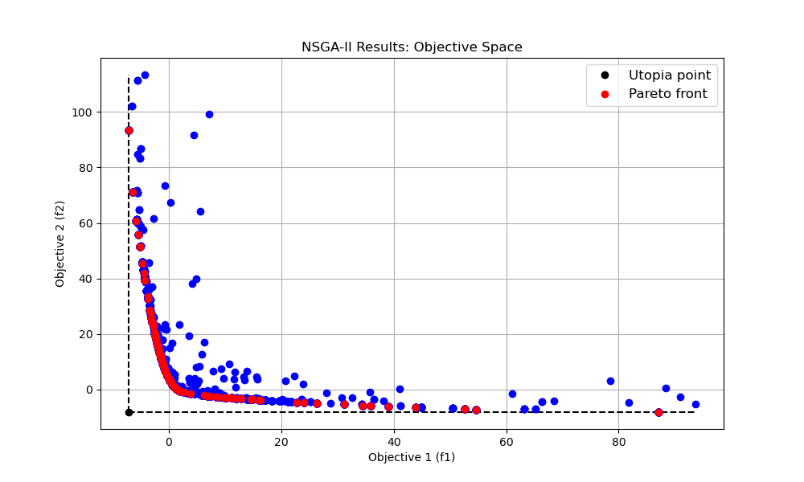

# Example for equation-oriented single objective optimization
Single objective optimization should start from main.py
You have to choose the method that you plan to use and import packages from them.
```python
from Bayesian import rbf_kernel, optimize, GaussianProcess
from Pso import PSO, optimize
from SA import SA, optimize
``` 
After importing you have to design the objective function on your own.
For equation-oriented optimization.
```python
def objective_function(x):
    x1 = x[0]
    x2 = x[1]
    return -(x1**2 - x2/5 + 10)
```
Subsequently, customized your algorith with sepecific information, such as upper and lower bondary, decimal places for all the input parameters, number of iteration, csv file name, collecting variables name.
```python
xMax, xMin = [10.0, 10.0], [-10.0, -10.0]
decimal = [2, 2]
n_iterations = 50
csv_filename = 'try'
wbpath = os.path.join(os.path.abspath('.'),csv_filename)
data_label = ['num of runs', 'input 1', 'input 2', 'score1']
```
It should be noted that each algorithm needs to be customized with specific parameters as well.

PSO requires: d (Dimension of matrix), size (population size), c1 and c2 (Exploring and Exploiting robustness)

Bayesian requires: kernel (Currently only rbf_kernel can choose)

Simulated Annealing requires: T0 (Initiating temperature), Tf (Termination temperature), k (Cooling gradient), step (Parameter moving speed), index (0 for contiunous, 1 for discrete random variable generating), X_init (Initial points)
```python
pso = PSO(d=2, size=40, c1=0.5, c2=0.5)
gp = GaussianProcess(kernel=rbf_kernel)
sa = SA(T0=100, Tf=0.1, k=0.85, step=[3, 3], index=[0, 0], X_init=[0, 0])
```
Run the optimization via optimization function.
```python
optimize(n_iterations,
         xMax,
         xMin,
         decimal,
         objective_function,
         gp, # Make sure the desired algorithm is added at here.
         csv_filename,
         wbpath, 
         data_label)
```

## Multi-objective optimization
In here both Fuzzy and NSGA-II can be used to perform the multi-objective optimization.
For NSGA-II, you can define the pop size, and mutation rate.
```python
nsga2 = NSGA(pop_size=100, mutation_rate=0.1)
```
It should be careful that the objective should be designed in following pqttern:
```python
def objective_function(x):
    x1 = x[0]
    x2 = x[1]
    f1 = x1**2 + x2
    f2 = (x2-2)**2 - x1
    return [f1, f2]
```
Besides, if you're doing bi-objective optimization you can apply the Pareto_plot.py to plot the Pareton front.
